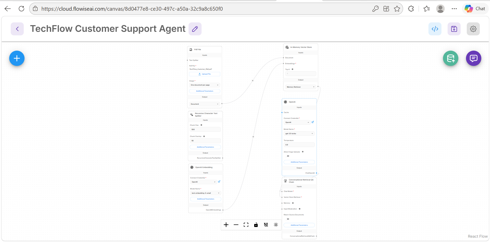
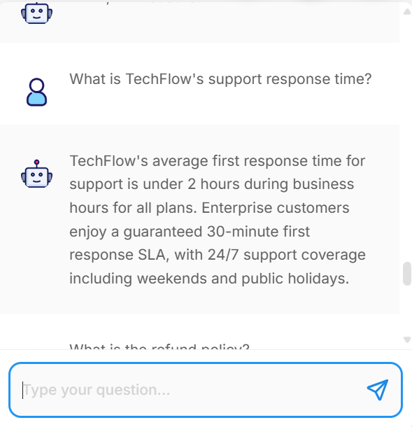

# Customer Support AI Agent (RAG System)

A customer support AI assistant built with Flowise, OpenAI embeddings, vector retrieval, and Retrieval-Augmented Generation (RAG).

## Features

- RAG-based document retrieval
- PDF-based knowledge base
- OpenAI embeddings
- In-memory vector store
- Conversational retrieval workflow
- Context-aware customer support responses

## Tech Stack

- Flowise
- OpenAI API
- OpenAI Embeddings
- Vector Store
- RAG
- Prompt Engineering

## How It Works

The system uses a company FAQ document as a knowledge base.  
When a user asks a question, the agent retrieves relevant information from the document and generates a clear support response.

## Project Screenshots

### Customer Support AI Workflow

### RAG-Based Customer Support Response

## Example Capabilities

- Answers support response time questions
- Retrieves refund policy details
- Handles integration-related questions
- Provides business-specific support answers

## Portfolio

https://saarika-ai.github.io
